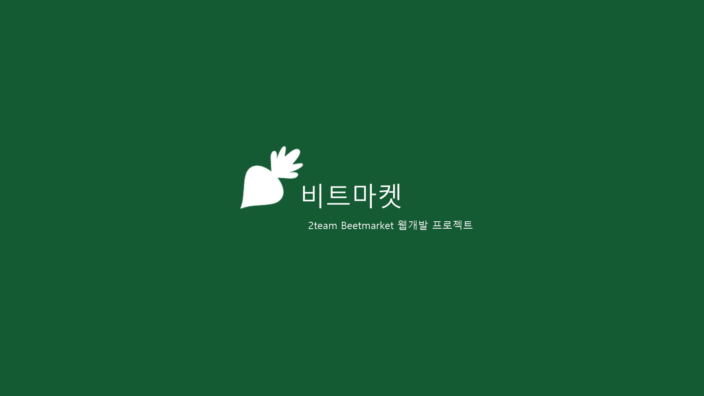

# 안녕하세요, 신입 개발자 이이섭입니다.
배우며 성장하고, 도움을 줄 수 있도록 노력하겠습니다.

| 경기도 의정부시 민락동  
| 010-2366-7237  
| aa990724@naver.com  

---

## Profile

- **경력(총 1년 2개월)**
  - 동아기업 (2022.11 ~ 2023.02)  
    - 그래픽 디자인 업무
    
- **학력**
  - 경기도 의정부부용고등학교(2015 - 2018)  

---

## Skills

### Hard Skills

SQL

  
- CRUD(Create, Read, Update, Delete) : 일반게시판, 공지사항, 메시지, 회원관리  
- 제약조건 : primaryKey, not null, unique, foreign key, check  
- DML : 데이터 (SELECT, INSERT, UPDATE, DELETE)  
- DDL : 테이블 생성/삭제 (CREATE, ALTER, DROP)  
- DCL : 권한관리 (GRANT, REVOKE)  
- JOIN : 여러 테이블 간 데이터 결합 (INNER JOIN, OUTER JOIN 등)  
- Subqueries : 서브쿼리를 활용한 복잡한 데이터 조회 (SELECT, WHERE, FROM)  
- Transaction : (COMMIT, ROLLBACK)
  

Java

  
- OOP(객체지향 프로그래밍)  
- 예외 처리  
- Spring MVC : `@Controller`, `@RestController`, `@RequestMapping`, `@GetMapping`, `@PostMapping`  
- 스프링 의존성 주입 : `@Autowired`, `@Component`, `@Service`, `@Repository`  
- Servlets  
- JSP
  

HTML

  - 기본태그: &lt;div&gt;, , 
, <h1> ~ <h6>, <a href="URL">,  <button>

CSS

  - 기본 스타일링: margin, padding, border, display, width, height, background-color, text-align, font-size
  - 레이아웃 & 정렬: display: flex, justify-content, align-items, gap, position: relative, absolute, float

JavaScript

  - 기본문법: let, const, function, if, for, each() 
  - 이벤트 처리: .click(), .change(), .submit(), .on()
  - DOM 조작: .text(), .html(), .val() .append(), .remove(), .hide(), .show(), .slideDown()
  - AJAX & 비동기 처리: $.ajax(), $.getJSON(), .load()
  - UI 인터랙션: .modal("show"), .modal("hide"), .slideDown(), .fadeIn(), .fadeOut()

### Soft Skills

소프트 스킬

- 팀원 간 빠른 소통  
- 효율적인 시간관리  

### 개발환경

언어

- Java  
- HTML  
- CSS  
- JavaScript  

IDE &amp; Tools

- Eclipse  
- STS  
- Visual Studio Code  
- GitHub  
- ERwin  

DB

- Oracle  
  - PL/SQL  

Libraries

- Lombok  
- jQuery  
- MyBatis  

Frameworks

- Spring Framework  

---

## Projects

### 세덱스(SedEx) 팀 프로젝트
스포츠 용품 쇼핑 서비스  

---

### 인터야드(interYard) 팀 프로젝트
온라인 종합 플랫폼  

---

### 비트마켓(Beetmarket) 팀 프로젝트
온라인 쇼핑 플랫폼  

---
